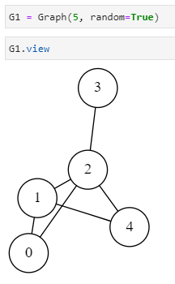

# PyGraph

`pygraph` est un petit module Python 3 qui s'appuie sur les modules [`networkx`](https://networkx.org/) et [`graphviz`](https://graphviz.readthedocs.io/) pour modéliser et visualiser des graphes orientés, non orientés et bi-partie.

L'idée de ce module `pygraph` est de créer un objet `Graph` (ou `DiGraph` ou `BiPartite`) qui soit la réunion de deux objets :

- un `model` qui est un graphe au sens de _networkx_
- une `view` qui est un graphe au sens de _graphviz_

## Principales fonctionnalités

- Créer un graphe non orienté (`Graph`), un graphe orienté (`DiGraph`) ou bi-partie (`BiPartite`). La création d'un graphe dans un notebook jupyter est particulièrement intéressante puisqu'alors la vue du graphe est directement possible dans une cellule :

- Ajouter des sommets et des liens (nom générique pour arètes ou arcs). Pour les graphes non orienté possibilité de créer un graphe aléatoire (basé sur `erdos_renyi_graph` de networkx, voir le [site officiel de NetworkX](https://networkx.org/documentation/stable/tutorial.html#graph-generators-and-graph-operations) pour plus de détails)
- Retirer des sommets et des liens (la construction d'un graphe bi-partie se fait en créant d'abord un graphe complet puis en retirant des liens)
- Changer couleurs et étiquettes des sommets
- Positionner les sommets sur une _grille virtuelle_ (via un système de coordonnées cartésiennes)
- Déplacer un sommet ou un groupe de sommets
- Redimensionner le graphe
- Sauver le dessin du graphe dans un fichier aux formats usuels (svg, png, jpg, pdf etc.)
- Lancer des algorithmes usuels : pour l'instant seule la colorisation est disponible

## En détail

### Créer un graphe

```python
Graph(n)                # un graphe non orienté à n sommets
Graph(n, random=True)   # aléatoire à n sommets
Graph(n, strict=True) # arêtes , arcs  le rendu doit fusionner plusieurs arêtes.
DiGraph(n)              # graphe orienté à n sommets il faut mettre les arcs à la main
BiPartite(n, m)         # graphe bi-partie complet nxm, on pourra supprimer des arètes
g.copy()                # crée une copie du graphe g
```

### Degré et voisins d'un sommet d'un graphe non orienté
```python
g.degree(s)            # le degré du sommet s
g.neighbors(s)         # un itérateur sur les voisins du sommet s
```

### Ajouter des sommets et des liens
```python
g.add_nodes(k)         # ajoute k sommets identifiés n, n+1, ... n+k-1 
                       # où n était le nombre de sommets initial, k = 1 par défaut
g.add_edge(self, s1, s2, weight=None)   # ajoute un lien du sommet s1 vers le sommet s2, possibilité d'ajouter le poids weight
g_add_edges_from(iterable) # ajoute les liens depuis les couples de l'itérable
```

### Supprimer des sommets et des liens
```python
g.remove_node(s)              # retire le sommet s ainsi que les liens qui lui sont adjacents
g.remove_nodes_from(iterable) # retire tous les sommets de l'iterable
g.remove_edge(s1, s2)         # retire lien s1 -- s2 
g.remove_edges_from(iterable) # retire tous les liens des couples de sommets de l'itérable
```

### Accès aux informations d'affichage d'un sommet
```python
g.node_view(s) # retourne l'objet vue du sommet s
# cet objet contient les propriétés modifiables :
color_id
label
pos
```

### Changer les couleurs des sommets
```python
g.color_on(s, name)      # colorise provisoirement le sommet s avec la couleur name 
g.color_on()             # affiche les couleurs de tous les sommets
g.color_off()            # masque les couleurs (retour au blanc)
g.color_on(s, num)       # attribue la couleur numéro num au sommet s équivalent à :
    g.node_view(s).color_id = num
    g.color_on()
g.colorise()             # applique l'algo DSATUR pour colorier le graphe faire un color_on() ensuite
g.greedy_color(strategy) # applique la fonction du module networkx de coloration, il faut préciser la stratégie
```

### Changer les couleurs des arêtes , arcs
```python

```

### Changer les étiquettes (par défaut = identifiant du sommet)
```python
g.set_labels(chaine)    # chaine doit être une chaîne de caractères de la longueur nombre de sommets
g.set_labels()          # réinitialise les étiquettes aux valeurs initiales = numéros des sommets
g.label_on()            # affiche les étiquettes définies pour chaque sommet s
g.label_off()           # masque les étiquettes
```

### Positionner les sommets
```python
g.position(iterable, ech=1) # iterable contient des triplet (s, x, y) : place sur une grille le sommet s aux coordonnées x, y. L'échelle du repère est le inch fois le coefficient ech
g.scale(ech) # modifie le positionnement des sommets déjà positionnés en appliquant la nouvelle échelle, pas d'impact si sommets ne sont pas placés
g.move(s, dx, dy, group=False) # déplace le sommet s positionné de dx sur l'axe des x et dy sur l'axe des y. Si group vaut True, les voisins de s sont déplacés aussi et les voisins des voisins etc. récursivement
g.same_position_as(g2) # attribue à chaque sommet s de g la même position que le sommet de même numéro dans g2
```

### Dimensionner les sommets
```python
g.resize(size, s=None) # le cercle du sommet fera size de diamètre ; si s non précisé s'applique à tous les sommets
g.resize() # redonne la valeur initiale de 0.3 (inch) aux dimensions des sommets
```

### Sauver dans un fichier
```python
g.write(filename='output', format='svg') # création d'un fichier <filename>.<fmt> contenant le dessin du graphe et de <filename> pour le source graphviz du graphe
```

### Charger un fichier
```python
g.load_json(self, filename, encoding='utf-8') # Ajoute a un graphe les informations contenues dans le fichier json filename 
```

## Algorithmes 

### Dijkstra
```python
Dijkstra(graph, start=0, end=None) # Objet dijkstra qui prend un graphe et les nœuds de départ -> arrivé en arguments 
                                   # Possède les méthodes permettant de résoudre le problème du plus cour chemin, étape par étape ou non.
d.solve()                          # Lance la résolution du plus court chemin 
d.next()                           # Lance la prochaine étape dans la résolution du plus cour chemin         
s.reset_dijkstra()                 # Réinitialise dijkstra
```
